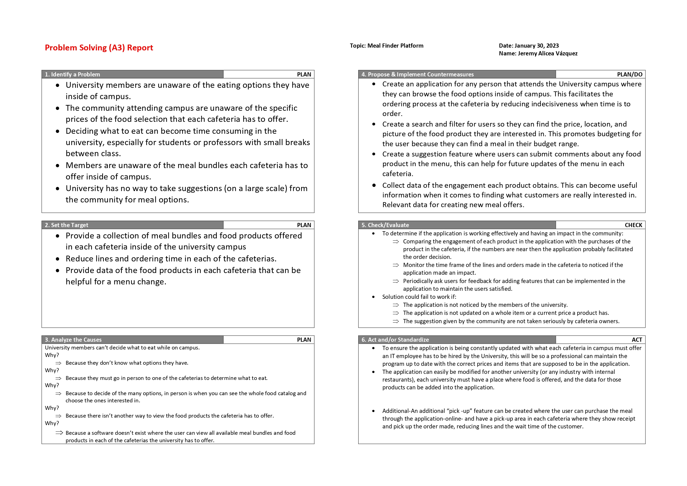

# Meal Finder
A web-app for university campus with a wide range of meals for students to chose from

### Shortcuts
1. [Project A3](#the-projects-a3)
2. [Technologies](#technologies)
3. [Running](#running)

## The project's A3

## Technologies
Written in Python 3 using the Django web-app framework. Python's built-in
venv module is used to create a virtual environment.

## Running
To start the server you must run `python manage.py runserver`. The `manage.py` file is
in the `site/meal_finder/` folder.